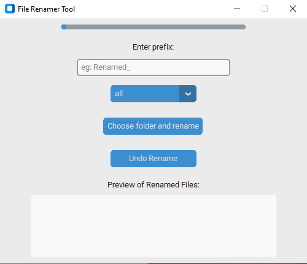

# 📂 File Renamer Tool – Python Automation App

A modern Python GUI tool that helps you **bulk rename files** in a folder with a custom prefix and timestamp. Built with `customtkinter`, it includes a live preview box, undo functionality, and a progress bar for a smooth user experience.

 
---

## ✨ Features

✅ Rename multiple files with:
- Custom **prefix**
- **Current date** automatically appended
- **Progress bar** to track rename status
- **Preview window** before renaming
- **Undo button** to revert changes
- **Confirmation popup** to prevent mistakes

🎯 Supports file types like: `.jpg`, `.jpeg`, `.png`, `.txt`, `.pdf`, or **all file types**

---

## 🛠️ Installation

### 1. Clone the repository
```bash
git clone https://github.com/your-username/file-renamer-tool.git
cd file-renamer-tool
```

### 2. Install dependencies
```bash
pip install customtkinter
```

### 3. How to Run
python file_renamer.py

### 4. How It Works

* Select a folder

* Enter a prefix (e.g., Renamed_)

* Select a file type (.jpg, .txt, etc. or all)

* Click “Choose folder and rename”

* Confirm in popup

* Done! Renamed files will appear in the same folder

* To undo, simply click Undo Rename

### 5. Future Features (Planned)
Drag & drop support

Save prefix history

Light/Dark theme toggle

Export rename log to file

## 👨‍💻 Author
Supun Wickramarachchi
Aspiring Software Engineer & Automation Enthusiast
🇱🇰 Sri Lanka

Dreaming to build systems for space and robotics 🚀

## 📃 License
This project is open source and free to use under the MIT License.

---